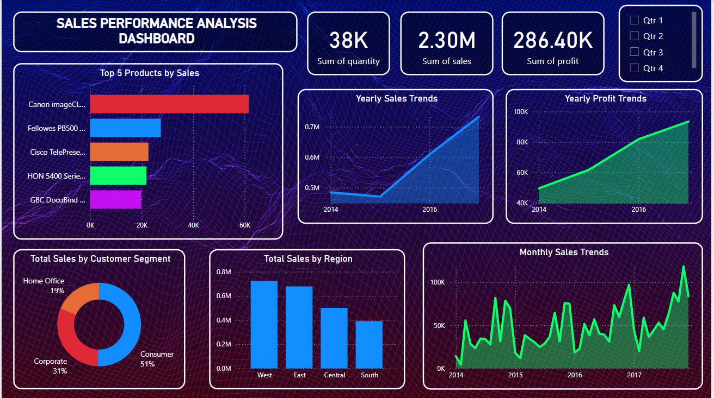

# Sales Performance Analysis Dashboard

## **Overview**
This project analyzes sales data from the Superstore dataset to provide actionable insights and visualizations. It includes data preprocessing, analysis using Python and SQL, and a Power BI dashboard for effective presentation.

The dashboard showcases trends, regional and customer segment performance, and top products to help understand and optimize sales strategies.

---

## **Tools and Technologies Used**
- **Python**: Data loading, cleaning, and visualization.
- **SQL**: Querying and grouping data.
- **Power BI**: Creating the interactive dashboard.
- **Libraries Used in Python**: Pandas, Matplotlib, Seaborn.

---

## **Steps/Process**
1. **Data Loading**: Imported the Superstore dataset using Python.
2. **Data Cleaning**: Removed unnecessary data and ensured quality by checking for duplicates and missing values.
3. **Analysis and Visualizations**: Created key insights using SQL queries and Python visualizations.
4. **Dashboard Creation**: Designed a Power BI dashboard showcasing:
   - Yearly Sales Trends
   - Top 5 Products by Sales
   - Total Sales by Customer Segment
   - Total Sales by Region
   - Yearly Profit Trends
   - Monthly Sales Trends

---

## **How to Run the Project**
1. Clone this repository to your local system:
   ```bash
   git clone <repository-url>
   ```
2. Open and execute the Python scripts in the following order:
   - `data_loading.py`
   - `data_cleaning.py`
   - `visualisation.py`
3. Run the SQL queries to analyze data (requires a database setup).
4. Open the Power BI file to explore the interactive dashboard.

---

## **Files Included**
1. `cleaned_super_store_data.csv`: Cleaned version of the Superstore dataset.
2. `data_loading.py`: Python script to load the dataset.
3. `data_cleaning.py`: Python script for cleaning the data.
4. `visualisation.py`: Python script for generating visualizations.
5. `SQLquery.sql`: Contains all SQL queries used in the project.
6. `sales_performance_analysis_dashboard.pbix`: Power BI file with the dashboard.
7. `background_images/`: Folder containing background images for the dashboard.

---

## **Visualizations**
Screenshots of the Power BI dashboard:

1. **Dashboard Overview**
   

---

## **Conclusion/Insights**
This analysis highlights critical aspects of the sales data, including:
- The most profitable products and regions.
- Yearly and monthly sales trends.
- Customer segment performance, aiding better business decisions.

---

